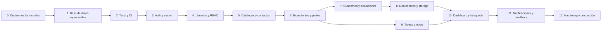

# Plan modular de implementación

## Objetivo

Completar el sistema mediante incrementos verticales pequeños, verificables y desplegables. Cada iteración entrega contrato, persistencia, reglas, API, integración mínima del frontend y pruebas. No se considera terminado un módulo que sólo tenga endpoints o sólo tenga pantalla.

## Estado de partida

Ya disponible:

- análisis funcional del frontend y contrato objetivo de API;
- arquitectura Node.js 22, Express 5, TypeScript y Prisma 7;
- schema relacional inicial;
- configuración por entorno, logging, RFC 7807 y health checks;
- adapter base de storage local;
- seed inicial de roles/permisos;
- Docker/Compose de desarrollo;
- lint, typecheck, build y tests iniciales.

Pendiente crítico: validar reglas del estudio, crear la migración inicial, implementar autenticación/RBAC y reemplazar gradualmente los mocks del frontend.

## Secuencia de dependencias



No se debe iniciar una iteración si su dependencia directa no cumple el criterio de salida. Investigación, diseño de UI o preparación de fixtures sí pueden adelantarse, pero no se integran contratos inestables.

## Método de trabajo por iteración

Cada incremento sigue este orden:

1. confirmar reglas y casos límite;
2. actualizar contrato HTTP, permisos y modelo si corresponde;
3. crear/revisar migración y constraints;
4. escribir primero tests de reglas y autorización críticas;
5. implementar repository/service;
6. implementar schemas Zod, controller/rutas y errores;
7. conectar el slice correspondiente del frontend;
8. ejecutar pruebas unitarias, integración, API y UI;
9. actualizar documentación y registro de progreso;
10. demostrar el flujo completo y cerrar la iteración.

## Iteración 0 — Decisiones funcionales y baseline

### Objetivo

Cerrar decisiones que impactan constraints, permisos y retención antes de congelar la primera migración.

### Definiciones requeridas

- matriz exacta de permisos de Jefe, Socia, Abogada y Secretaria;
- unicidad del número de expediente: global, por año o por juzgado;
- roles procesales y tipos de causa/cuaderno necesarios;
- transiciones permitidas para expedientes, cuadernos y tareas;
- reglas de cierre, archivo, reapertura y eliminación;
- edición/borrado de notas y comentarios;
- MIME, tamaño y retención de documentos;
- recuperación de contraseña y proveedor de email;
- RPO/RTO y destino externo de backups;
- datos iniciales que deben migrarse desde mocks.

### Entregables

- decisiones registradas en `docs/PROJECT.md` y `docs/API.md`;
- matriz RBAC versionada;
- catálogo de transiciones por entidad;
- lista de datos reales/prohibidos para desarrollo;
- backlog priorizado sin ambigüedades de negocio.

### Pruebas

No aplica código de dominio; cada regla debe expresarse como ejemplo aceptado/rechazado que luego se convertirá en test.

### Criterio de salida

El estudio aprueba las reglas P0 o acepta explícitamente defaults documentados para poder crear la migración.

## Iteración 1 — PostgreSQL y migración inicial reproducible

### Backend/infraestructura

- revisar el schema Prisma contra las decisiones de Iteración 0;
- generar `prisma/migrations/<timestamp>_initial/migration.sql`;
- agregar SQL que Prisma no expresa: constraints parciales, checks, índices de búsqueda y grants;
- definir rol owner/migrador y rol de aplicación sin DDL;
- separar bootstrap de infraestructura, migración y seed;
- completar seed idempotente de permisos, roles y catálogos estables;
- crear comando de bootstrap del primer administrador sin contraseña hardcodeada;
- documentar upgrade, rollback lógico y restauración local.

### Pruebas

- aplicar todas las migraciones desde una DB vacía;
- volver a ejecutar deploy sin cambios;
- ejecutar seed dos veces y comprobar resultado idéntico;
- verificar constraints, claves foráneas, unicidad e índices críticos;
- comprobar que el rol runtime no puede crear/alterar tablas;
- generar Prisma Client y compilar.

### Criterio de salida

Una persona nueva puede levantar PostgreSQL, aplicar migraciones/seed y obtener exactamente el mismo esquema sin pasos manuales ocultos.

## Iteración 2 — Harness de integración y CI

### Backend/infraestructura

- separar tests `unit`, `api` e `integration`;
- crear lifecycle de DB de test exclusiva y descartable;
- agregar factories sintéticas para usuarios, contactos y expedientes;
- helpers para autenticar requests cuando exista Auth;
- pipeline CI: install reproducible, Prisma generate, lint, typecheck, migración desde cero, tests, build y auditoría runtime;
- harness del frontend con tests unitarios/de componentes y build dentro de CI;
- preparar E2E de navegador para incorporar flujos desde la Iteración 3;
- reporte de cobertura orientativo, sin usar porcentaje como sustituto de casos críticos;
- impedir que integración se saltee silenciosamente si falta DB.

### Pruebas del propio harness

- aislamiento entre tests;
- rollback/reset determinista;
- migraciones ejecutadas antes de integración;
- fallo explícito ante `DATABASE_URL_TEST` insegura o no exclusiva;
- fixtures sin información personal real.

### Criterio de salida

Cada push recibe una señal reproducible y bloqueante sobre schema, tipos, comportamiento y build.

## Iteración 3 — Autenticación, sesiones y protección HTTP

### Backend

- `AuditService` y `OutboxService` transaccionales como prerequisitos compartidos; el worker se implementa más adelante;
- helper común de validación Zod para params, query y body;
- `PasswordService`: Argon2id, parámetros configurados y rehash progresivo;
- `TokenService`: tokens CSPRNG y SHA-256 para persistencia;
- `SessionService`: emisión, expiración absoluta/inactiva, renovación y revocación;
- `AuthService`: login, logout, logout global, usuario actual;
- middlewares `authenticate`, `csrfProtection` y `loginRateLimit`;
- cookie HttpOnly/Secure/SameSite y borrado consistente;
- bloqueo temporal por intentos fallidos sin revelar existencia de cuenta;
- recuperación/reset de contraseña; si aún no hay email, adapter local sólo para desarrollo;
- auditoría de login, fallos, logout y cambio de contraseña sin registrar secretos.

### Rutas

- `POST /auth/login`
- `POST /auth/logout`
- `POST /auth/logout-all`
- `GET /auth/me`
- `GET /auth/csrf`
- `POST /auth/forgot-password`
- `POST /auth/reset-password`

### Frontend

- cliente HTTP único con cookies y manejo de problem details;
- pantalla de login real;
- bootstrap de sesión con `/auth/me`;
- estados de carga, sesión expirada y acceso no autorizado;
- logout y protección de rutas.

### Pruebas

- password correcto/incorrecto y rehash;
- sesión válida, expirada, inactiva y revocada;
- DB sólo contiene hash del token;
- cookies con flags correctos por ambiente;
- CSRF/Origin aceptado y rechazado;
- rate limit y bloqueo;
- forgot-password anti-enumeración;
- reset de un solo uso y revocación de sesiones anteriores;
- logs sin password, cookie ni token.
- negocio + auditoría + outbox se confirman o revierten juntos.

### Criterio de salida

Un administrador de prueba inicia/cierra sesión desde la SPA; refresh conserva sesión y una sesión revocada deja de funcionar inmediatamente.

## Iteración 4 — Usuarios, roles y autorización

### Backend

- `AuthorizationService` y `ActorContext`;
- middleware `requirePermission`;
- CRUD controlado de usuarios y roles;
- asignación de permisos atómicos;
- alta segura/invitación sin enviar passwords en claro;
- suspensión/desactivación con revocación de sesiones;
- impedir eliminar/desactivar el último administrador efectivo;
- invalidar/rotar sesión al cambiar privilegios;
- auditoría de cambios de usuario, rol y permisos.

### Frontend

- usar usuario/rol real en header y navegación;
- ocultar acciones no autorizadas sin depender sólo de la UI;
- pantalla de equipo conectada;
- administración mínima de usuarios/roles para quien tenga permiso.

### Pruebas

- matriz completa permiso × endpoint;
- usuario suspendido o desactivado;
- escalada vertical y horizontal rechazada;
- protección del último administrador;
- cambio de rol efectivo en nueva sesión;
- respuestas nunca incluyen hashes/campos internos.

### Criterio de salida

La UI y la API reflejan permisos reales, y un request manual no puede eludir restricciones ocultando/mostrando botones.

## Iteración 5 — Catálogos y contactos

### Backend

- CRUD de juzgados y oficinas de gestión;
- lectura de catálogos/enums localizados;
- contactos persona/organización;
- categorías, canales y domicilios;
- normalización de nombre, documento, CUIT, email y teléfono;
- detección de duplicados y reglas de principal;
- paginación por cursor, búsqueda y filtros;
- baja lógica y restricciones si el contacto participa en causas;
- auditoría de mutaciones.

### Frontend

- reemplazar mocks del directorio de contactos;
- alta, detalle y edición completos;
- selector reutilizable de contactos para futuras partes;
- catálogos reales para formularios.

### Pruebas

- persona vs organización;
- documento/CUIT duplicado normalizado;
- múltiples canales y único principal por tipo;
- búsqueda con acentos/mayúsculas;
- cursor estable;
- autorización y acceso horizontal;
- optimistic locking y baja con relaciones.

### Criterio de salida

Se crea, busca, edita y consulta un contacto desde la SPA sin usar `localStorage` para este dominio.

## Iteración 6 — Expedientes, partes y equipo

### Backend

- alta/listado/detalle/edición de expedientes;
- filtros por estado, tipo, responsable, juzgado y fechas;
- partes múltiples, lados procesales y cliente representado;
- representaciones profesionales;
- responsable principal y colaboradores;
- transiciones de estado e historial;
- resumen para tabs y timeline base;
- transacción de alta completa con auditoría/outbox;
- optimistic locking y reglas de archivo/baja.

### Frontend

- listado real de expedientes;
- formulario de alta con contactos, radicación, partes y responsable;
- detalle/cabecera conectados;
- edición y cambio de estado;
- reemplazar `clientId`/`opponentId` por participantes múltiples.

### Pruebas

- alta atómica y rollback ante una parte inválida;
- unicidad de número según regla aprobada;
- exactamente un responsable principal vigente;
- transiciones permitidas/prohibidas;
- historial append-only;
- conflicto de versión;
- filtros/paginación;
- IDOR y permisos de cierre/archivo.

### Criterio de salida

Un usuario crea desde la UI un expediente con varias partes y equipo; otro usuario autorizado lo consulta con historial consistente.

## Iteración 7 — Cuadernos, actuaciones y timeline

### Backend

- CRUD y transiciones de cuadernos de prueba/incidentes;
- actuaciones vinculadas al expediente o a un cuaderno;
- validación de fechas, tipo, presentación y autoría;
- edición/baja restringida y auditada;
- timeline paginado que unifica actuaciones y eventos relevantes;
- conteos/resúmenes para la pantalla de detalle.

### Frontend

- tabs reales de cuadernos e incidentes;
- alta/detalle de actuación;
- timeline y filtros;
- estados vacíos, errores y optimistic locking.

### Pruebas

- actuación en expediente/cuaderno válido;
- impedir mezcla entre expedientes;
- cierre de cuaderno y operaciones posteriores;
- orden cronológico estable con empates;
- autorización por expediente;
- auditoría y rollback.

### Criterio de salida

La línea de tiempo jurídica principal funciona de extremo a extremo sin datos simulados.

## Iteración 8 — Documentos y storage privado

### Backend

- completar interfaz `StorageService` y adapter filesystem;
- upload multipart por streaming a temporal;
- límites de bytes, nombre seguro, MIME real y extensiones permitidas;
- SHA-256 y persistencia atómica;
- documento + versiones inmutables;
- vínculos con expediente, cuaderno, actuación, tarea o nota;
- descarga autorizada y soporte futuro de `X-Accel-Redirect`;
- escaneo antivirus mediante outbox/worker;
- estados de scan y bloqueo de descarga infectada/pendiente según política;
- retención, archivo y cleanup de huérfanos.

### Frontend

- subir archivos con progreso/errores;
- listar metadatos y versiones;
- descargar versión autorizada;
- reemplazar el booleano simulado `hasFile`.

### Pruebas

- path traversal, claves absolutas y separadores alternativos;
- límite real aunque `Content-Length` sea falso/ausente;
- MIME/extensión inconsistente;
- checksum, upload interrumpido y cleanup;
- dos versiones inmutables;
- acceso horizontal a descarga;
- archivo ausente vs metadata;
- scan infectado/failed y concurrencia.

### Criterio de salida

Se sube, versiona y descarga un PDF real desde una actuación, sin URL pública ni path físico expuesto.

## Iteración 9 — Tareas, asignaciones, comentarios y notas

### Backend

- CRUD de tareas y filtros para Kanban/listado;
- transiciones de estado con historial;
- asignación/reasignación múltiple según regla aprobada;
- prioridades, vencimientos y relación opcional a expediente;
- comentarios con reglas de edición/baja;
- notas internas por expediente, cuaderno o contacto;
- auditoría y outbox para asignaciones/vencimientos.

### Frontend

- Kanban real y vista de lista;
- drag/drop respaldado por transición API y rollback visual;
- detalle, asignaciones y comentarios;
- notas conectadas en cada contexto.

### Pruebas

- transición válida/inválida;
- concurrencia de drag/drop con `version`;
- reasignación e historial;
- tareas vencidas y zonas horarias;
- comentario propio vs permiso administrativo;
- notas privadas/autorizadas;
- filtros combinados y cursor.

### Criterio de salida

El flujo diario de asignar, mover, comentar y completar tareas funciona entre dos usuarios reales.

## Iteración 10 — Dashboard, búsqueda y métricas

### Backend

- `DashboardService` con agregados acotados por permisos;
- búsqueda global de expedientes, contactos y actuaciones;
- normalización e índices PostgreSQL necesarios;
- métricas de equipo por rango temporal;
- límites, timeouts y planes de consulta revisados;
- evitar N+1 y payloads de detalle innecesarios.

### Frontend

- dashboard con métricas reales;
- búsqueda global navegable;
- vista de equipo con rangos/filtros;
- skeletons, estados vacíos y errores parciales.

### Pruebas

- agregados con dataset conocido;
- aislamiento por permisos;
- acentos, mayúsculas y términos parciales;
- límites de búsqueda y query vacía;
- snapshots de `EXPLAIN`/presupuesto de queries críticas cuando sea útil;
- consistencia temporal y zona horaria.

### Criterio de salida

Dashboard y búsqueda reflejan los datos creados en iteraciones anteriores y no consultan mocks.

## Iteración 11 — Notificaciones, feedback y worker

### Backend

- proceso `worker.ts` independiente;
- claim atómico de outbox con `SKIP LOCKED`;
- reintentos, backoff, idempotencia y estado terminal;
- notificaciones por asignación, vencimiento y eventos definidos;
- preferencias por usuario;
- feedback y circuito de resolución;
- housekeeping de sesiones/tokens/eventos;
- health/observabilidad del worker.

### Frontend

- bandeja y contador de no leídas;
- marcar una/todas como leídas;
- preferencias;
- formulario “Sugerir mejora” y administración según permiso.

### Pruebas

- dos workers no reclaman el mismo evento simultáneamente;
- reintento e idempotencia;
- evento fallido termina y alerta;
- preferencias respetadas;
- usuario no puede leer notificación ajena;
- feedback visible sólo para permisos correspondientes.

### Criterio de salida

Una asignación genera exactamente una notificación procesada por un worker separado y visible para el destinatario.

## Iteración 12 — Hardening, migración final y producción

### Seguridad y calidad

- revisión de permisos endpoint por endpoint;
- pruebas automatizadas de IDOR/CSRF/rate limit/path traversal;
- parámetros Argon2 medidos en el VPS;
- política de secretos y rotación;
- headers, límites del proxy y tamaño de request coherentes;
- ClamAV o alternativa validada;
- revisión de dependencias e imagen base;
- OpenAPI/contratos publicados para el equipo;
- eliminar mocks y `localStorage` funcional del bundle productivo.

### Operación

- staging con la misma topología que producción y datos sintéticos;
- reverse proxy TLS, firewall y usuario sin privilegios;
- volúmenes persistentes y permisos de filesystem;
- job único de migración y estrategia de rollback;
- backup cifrado externo de PostgreSQL + archivos;
- restauración completa ensayada;
- logs, métricas y alertas;
- runbooks de deploy, rollback, incidente, disco lleno y restauración;
- smoke tests post-deploy.

### Pruebas

- E2E de todos los flujos críticos;
- carga moderada y concurrencia en endpoints sensibles;
- caída/reinicio de API, worker, PostgreSQL y storage;
- restauración en staging y validación de checksums;
- migración desde la versión anterior con copia anonimizada;
- prueba de que producción no puede ejecutar con configuración insegura.

### Criterio de salida

El sistema se despliega y revierte mediante un procedimiento repetible; existe backup externo restaurado con éxito y los flujos críticos pasan en staging.

## Gates permanentes de calidad

Cada merge debe pasar:

```bash
npm run db:validate
npm run lint
npm run typecheck
npm test
npm run build
npm run audit:runtime
```

En `front/`, una vez incorporado el harness de Iteración 2, también deben pasar lint, tests de componentes y build. Los E2E se agregan al gate cuando el primer flujo de autenticación esté estable.

Cuando haya migraciones o integración:

- migración desde DB vacía;
- migración desde la versión anterior soportada;
- tests con PostgreSQL real;
- seed idempotente;
- revisión manual del SQL generado.

## Definición de terminado por módulo

Un módulo queda terminado sólo si incluye:

- reglas y casos límite aprobados;
- schema/migración/constraints e índices;
- permisos y pruebas de autorización;
- Zod para params, query y body;
- service, repository cuando aporta valor y transacciones;
- respuestas/errores documentados;
- auditoría y outbox cuando corresponde;
- tests unitarios, API e integración;
- frontend conectado con loading/error/empty states;
- documentación actualizada;
- ejecución verde de todos los gates.

## Estrategia de commits y revisión

- un cambio de infraestructura o migración separado de un cambio visual grande;
- una migración no se mezcla con refactors no relacionados;
- cada PR debe poder revisarse y probarse de forma independiente;
- no dejar endpoints temporales sin autorización “para conectarlos después”;
- usar feature flags sólo cuando permitan integrar código incompleto sin exponerlo;
- conservar compatibilidad del contrato durante el despliegue frontend/backend o coordinar una ventana explícita.

## Seguimiento

Al iniciar una iteración, crear un checklist con sus entregables y pruebas. Al cerrarla, registrar:

- decisiones tomadas;
- migraciones creadas;
- endpoints habilitados;
- pantallas conectadas;
- pruebas y evidencia de ejecución;
- deuda aceptada con responsable/criterio de resolución;
- riesgos o bloqueos para la siguiente iteración.

La prioridad inmediata es **Iteración 0**, seguida por **Iteración 1**. El scaffolding actual permite trabajar ambas sin reestructurar el proyecto.
